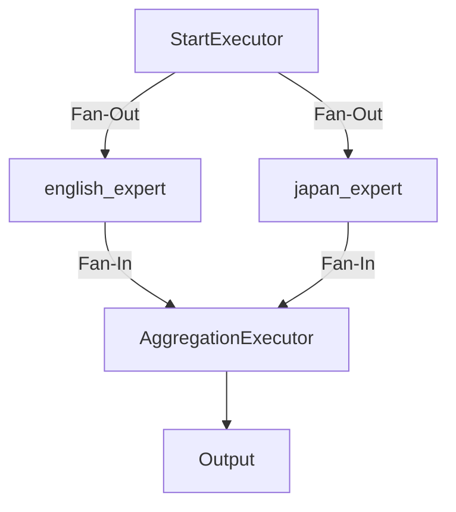

## Microsoft Agent Framework - Workflow 并行执行

在之前的文章中，我们可能已经熟悉了顺序执行的工作流，任务按部就班地一步步完成。今天，我们将探讨一个更强大、更高效的模式：**并行执行（Concurrent Execution）**。

### 什么是并行执行？

想象一下，你需要向多位不同领域的专家（例如，一位英语专家和一位日语专家）咨询同一个问题，并希望**同时**得到他们的答复，而不是一个接一个地等待。并行执行就是为了解决这类场景而设计的。

在 Workflow 中，我们可以将一个任务同时分发给多个 Agent，让它们并行处理，最后再将它们的结果汇总起来。这种“分而治之”再“合而为一”的模式，极大地提高了处理效率，并能轻松实现多视角分析、任务分发等复杂场景。

### 关键组件：`Fan-Out` 和 `Fan-In`

为了在 `WorkflowBuilder` 中构建并行流程，我们需要了解两个核心概念：

1.  **`AddFanOutEdge`（扇出）**: 这个方法创建一个“扇出”边，它将单个源节点（通常是一个分发任务的 Executor）的输出，同时发送给多个目标节点（如此处的多个 Agent）。它就像一个任务分发中心。

2.  **`AddFanInEdge`（扇入）**: 这个方法创建一个“扇入”边，它会收集多个源节点（如此处的多个 Agent）的输出，然后将这些输出作为一个列表，发送给单个目标节点（通常是一个聚合结果的 Executor）。它就像一个结果回收站。

下面这张图清晰地展示了这个流程：



### 代码实例解析

让我们通过一个具体的例子来深入理解。下面的代码演示了如何创建一个向“英语专家”和“日语专家”同时提问，并汇总他们回答的 Workflow。

#### 1. 定义并行任务的启动和聚合 Executor

为了管理并行流程，我们创建了两个专门的 `Executor`：

*   `ConcurrentStartExecutor`: 负责启动整个并行流程。它通过 `context.SendMessageAsync` 广播用户消息和 `TurnToken`，从而激活所有连接的 Agent，让它们开始处理任务。
*   `ConcurrentAggregationExecutor`: 负责聚合结果。它会收集所有并行 Agent 返回的消息。在这个例子中，它被设计为当收集到两条消息（来自英语和日语专家）后，将它们格式化并作为最终结果输出。

```csharp
using System.ClientModel;
using Microsoft.Extensions.AI;
using OpenAI;
using Microsoft.Agents.AI.Workflows;
using OpenAI.Chat;

namespace MSAgentFramework.Learn.workflow
{
    /// <summary>
    /// Executor that starts the concurrent processing by sending messages to the agents.
    /// </summary>
    internal sealed class ConcurrentStartExecutor() : Executor<string>("ConcurrentStartExecutor")
    {
        /// <summary>
        /// Starts the concurrent processing by sending messages to the agents.
        /// </summary>
        /// <param name="message">The user message to process</param>
        /// <param name="context">Workflow context for accessing workflow services and adding events</param>
        /// <param name="cancellationToken">The <see cref="CancellationToken"/> to monitor for cancellation requests.
        /// The default is <see cref="CancellationToken.None"/>.</param>
        /// <returns>A task representing the asynchronous operation</returns>
        public override async ValueTask HandleAsync(string message, IWorkflowContext context, CancellationToken cancellationToken = default)
        {
            // Broadcast the message to all connected agents. Receiving agents will queue
            // the message but will not start processing until they receive a turn token.
            await context.SendMessageAsync(new Microsoft.Extensions.AI.ChatMessage(ChatRole.User, message), cancellationToken);

            // Broadcast the turn token to kick off the agents.
            await context.SendMessageAsync(new TurnToken(emitEvents: true), cancellationToken);
        }
    }

    /// <summary>
    /// Executor that aggregates the results from the concurrent agents.
    /// </summary>
    internal sealed class ConcurrentAggregationExecutor() :
        Executor<List<Microsoft.Extensions.AI.ChatMessage>>("ConcurrentAggregationExecutor")
    {
        private readonly List<Microsoft.Extensions.AI.ChatMessage> _messages = [];

        /// <summary>
        /// Handles incoming messages from the agents and aggregates their responses.
        /// </summary>
        /// <param name="message">The message from the agent</param>
        /// <param name="context">Workflow context for accessing workflow services and adding events</param>
        /// <param name="cancellationToken">The <see cref="CancellationToken"/> to monitor for cancellation requests.
        /// The default is <see cref="CancellationToken.None"/>.</param>
        /// <returns>A task representing the asynchronous operation</returns>
        public override async ValueTask HandleAsync(List<Microsoft.Extensions.AI.ChatMessage> message, IWorkflowContext context, CancellationToken cancellationToken = default)
        {
            this._messages.AddRange(message);

            if (this._messages.Count == 2)
            {
                var formattedMessages = string.Join(Environment.NewLine,
                    this._messages.Select(m => $"{m.AuthorName}: {m.Text}"));
                await context.YieldOutputAsync(formattedMessages, cancellationToken);
            }
        }
    }
    // ...
}
```

#### 2. 构建并运行 Workflow

接下来，我们定义 Agent，并使用 `WorkflowBuilder` 将所有部分连接起来。

1.  **定义 Agent**: 我们创建 `english_expert` 和 `japan_expert` 两个 Agent，并分别给予它们不同的指令。
2.  **构建工作流**:
    *   以 `startExecutor` 作为起点。
    *   使用 `AddFanOutEdge` 将 `startExecutor` 与 `english_expert` 和 `japan_expert` 连接起来，实现任务分发。
    *   使用 `AddFanInEdge` 将 `english_expert` 和 `japan_expert` 的输出连接到 `aggregationExecutor`，实现结果聚合。
    *   最后，指定 `aggregationExecutor` 的输出为整个工作流的最终输出。

```csharp
// ...
internal class Concurrent
{
    public async Task Run()
    {
        var endpoint = "https://api.deepseek.com/v1";
        var apiKey = "sk-xxx";

        var english_expert = new OpenAIClient(
                new ApiKeyCredential(apiKey)
                , new OpenAIClientOptions()
                {
                    Endpoint = new Uri(endpoint)
                }
                )
            .GetChatClient("deepseek-chat")
            .CreateAIAgent(instructions: "你是一个英语专家，你总是使用英文回答问题.", name: "english_expert");

        var japan_expert = new OpenAIClient(
                new ApiKeyCredential(apiKey)
                , new OpenAIClientOptions()
                {
                    Endpoint = new Uri(endpoint)
                }
            )
            .GetChatClient("deepseek-chat")
            .CreateAIAgent(instructions: "你是一个日语专家，你总是使用日语回答问题.", name: "japan_expert");


        var startExecutor = new ConcurrentStartExecutor();

        var aggregationExecutor = new ConcurrentAggregationExecutor();

        // Build the workflow by adding executors and connecting them
        var workflow = new WorkflowBuilder(startExecutor)
            .AddFanOutEdge(startExecutor, targets: [english_expert, japan_expert])
            .AddFanInEdge(aggregationExecutor, sources: [english_expert, japan_expert])
            .WithOutputFrom(aggregationExecutor)
            .Build();

        // Run the workflow
        await using StreamingRun run = await InProcessExecution.StreamAsync(workflow, "西瓜可以吃吗?");
        await foreach (WorkflowEvent evt in run.WatchStreamAsync())
        {
            if (evt is WorkflowOutputEvent output)
            {
                Console.WriteLine($"Workflow completed with results:\n{output.Data}");
            }
        }
    }
}
```

#### 3. 查看结果

当我们用问题“西瓜可以吃吗?”运行此工作流时，`english_expert` 和 `japan_expert` 会同时开始思考并生成答案。`aggregationExecutor` 收集到两个答案后，将它们组合并输出。最终，你会看到类似下面的结果：

```
Workflow completed with results:
english_expert: Yes, absolutely! Watermelon is not only safe to eat, but it's also a delicious and nutritious fruit. It's rich in vitamins (like vitamin A and C), antioxidants, and has a high water content, making it hydrating. Just be sure to wash the rind before cutting if you plan to slice it, and avoid eating the seeds if you prefer seedless varieties. Enjoy!
japan_expert: はい、スイカは食べられます。スイカは夏の定番フルーツで、甘くてみずみずしい果肉が特徴です。生でそのまま食べるほか、サラダやスムージー、デザートなどにも使われます。種を取り除いて食べるのが一般的ですが、種ごと食べられる品種もあります。栄養面では水分が多く、ビタミンCやカリウムなどを含んでいます。ただし、体を冷やす作用があるので、食べ過ぎには注意しましょう。
```

### 总结

通过 `AddFanOutEdge` 和 `AddFanInEdge`，Microsoft Agent Framework 的 Workflow 功能为我们提供了一种简洁而强大的方式来编排并行任务。这不仅限于多语言翻译，还可以应用于：

*   **多角度分析**：让不同角色的 Agent（如“代码审查员”、“安全分析师”、“性能优化师”）同时分析一段代码。
*   **分布式数据处理**：将一个大数据集切片，分发给多个 Agent 并行处理。
*   **工具并行调用**：同时调用多个外部 API 或工具，并等待所有结果返回。

希望这篇博客能帮助你理解并开始在你的项目中使用并行工作流，以构建更高效、更智能的 Agent 应用。